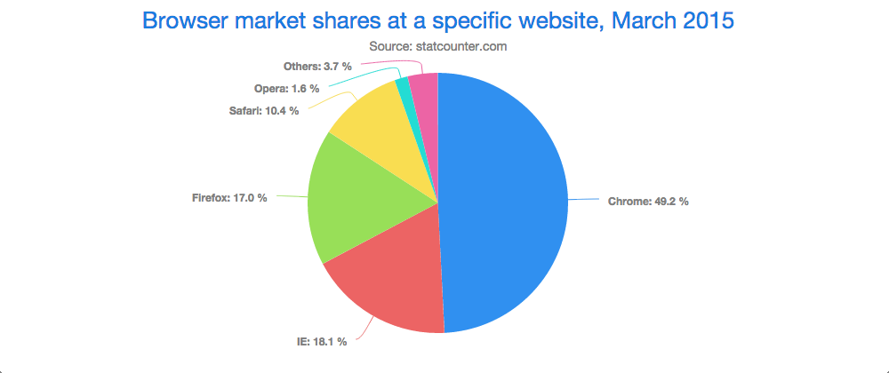
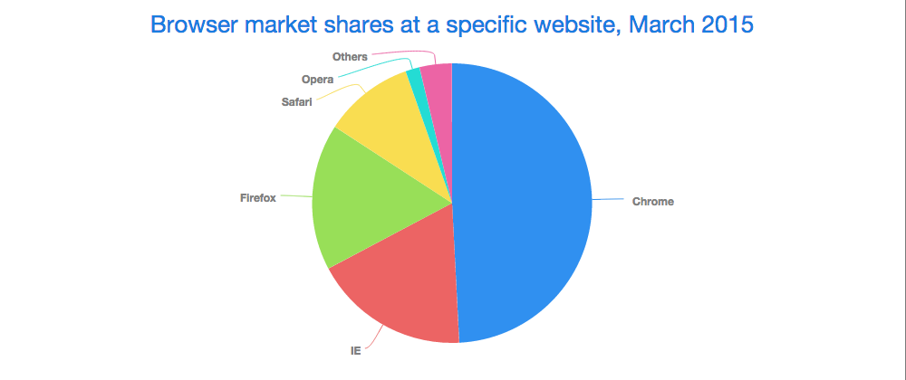

# Vaadin Charts Web Component

## Overview
Vaadin Charts is a feature-rich interactive charting library for Web Components developers. It provides a Chart Web Component. The Chart can visualize one- and two-dimensional numeric data in many available chart types. The charts allow flexible configuration of all the chart elements as well as the visual style. The library includes a built-in visual theme, which you can extend further. 

<figure>
    
    <figcaption>Vaadin Charts Web Component Example</figcaption>
</figure>

The data displayed in a chart can be one- or two dimensional tabular data, or scatter data with free X and Y values. Data displayed in range charts has minimum and maximum values instead of singular values.

In the following basic example, we demonstrate how to display one-dimensional data in a pie chart and customize its title.

    <html>
        <head lang="en">
            <!-- Load platform support -->
            
            <!-- Load the component using an HTML Import -->
            <link rel="import" href="../v-chart.html">
        </head>
        <body>
            <!-- Declare the chart element by its tag. -->
            <v-chart id="pieChart" type="pie">
                <title>Browser market shares at a specific website, March 2015</title>
    
                <!-- Declare the series element by its tag. -->
                <v-chart-series name="Browser share" values="[[&quot;Chrome&quot;,   49.19],
                    [&quot;IE&quot;,       18.06],
                    [&quot;Firefox&quot;, 16.96],
                    [&quot;Safari&quot;,    10.4],
                    [&quot;Opera&quot;,     1.65],
                    [&quot;Others&quot;,   3.74]]">
                </v-chart-series>
            </v-chart>
        </body>
    </html>

<figure>
    
    <figcaption>Simple Pie Example</figcaption>
</figure>

Vaadin Charts is based on Highcharts JS, a charting library written in JavaScript.

## Getting Vaadin Charts

### Bower

If you are using [Bower](http://bower.io) for managing your front-end dependencies you can install Vaadin Charts dependency by running the following command inside your project folder:

    $ bower install --save vaadin-charts#3.0.0-alpha1
    
This will download Vaadin Components and its dependencies to the `bower_components` folder inside your project's folder.

### CDN

You can use Vaadin Components from CDN using the following URL:

    https://cdn.vaadin.com/vaadin-charts/3.0.0-alpha1/v-chart.html

### Download ZIP

Download the latest 3.* ZIP archive from [vaadin.com/directory](https://vaadin.com/directory#!addon/vaadin-charts)

## Licensing
Vaadin Charts is a commercial product licensed under the CVAL License (Commercial Vaadin Add-On License). A license needs to be purchased for all use, including web deployments as well as intranet use. Using Vaadin Charts does not require purchasing a separate Highcharts JS license.

The commercial licenses can be purchased from the [Vaadin Directory](https://vaadin.com/directory/ "Vaadin Directory") , where you can also find the license details and download the Vaadin Charts