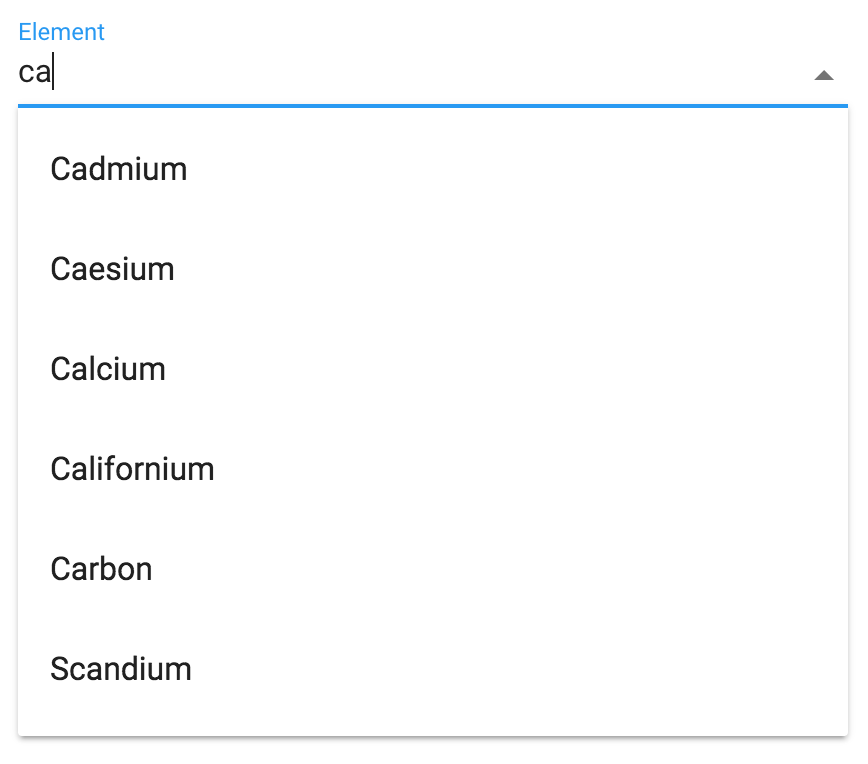

[[vaadin-combo-box.overview]]
= Overview

The [elementname]#vaadin-combo-box# is a Polymer element combining a dropdown list with an input field for filtering the list of items.

You can consider it as a filterable select element for situations where you have more than a few dozen items to select from.
It allows users to quick filtering the list and select an item using either keyboard, mouse or touch actions.

= Features

- A filterable select element for situations when you have more than a few dozens of items to select from.
- Keyboard navigation
- Compatible with iron-form
- Works great on mobile and desktop
- Material Design inspired styles to fit in with Paper Elements

[[figure.vaadin-combo-box.overview]]
.A screenshot of the [vaadinelement]#vaadin-combo-box# element

