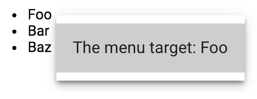

[[vaadin-context-menu.context]]
= Menu Context

You can use data bindings to the following properties in the menu template:

- [propertyname]#target# is the menu opening event target, which is the element that the user has called the context menu for
- [propertyname]#detail# is the menu opening event detail

In the following example, the menu item text is composed with the contents of the element that opens the menu:

[source,html]
----
<vaadin-context-menu selector="li">
  <template>
    <paper-menu>
      <paper-item>The menu target: [[target.textContent]]</paper-item>
    </paper-menu>
  </template>

  <ul>
    <li>Foo</li>
    <li>Bar</li>
    <li>Baz</li>
  </ul>
</vaadin-context-menu>
----

[[figure.vaadin-context-menu.on-list]]
.[vaadinelement]#vaadin-context-menu# displays contents of the menu opener element

== Accessing the Context on Menu Item Click

Sometimes in the click handler of a menu item it is required to access the menu context. It might be useful to read properties of the element that opened the menu, or read the menu opening event data. For this purpose, you can bind the menu template variables to the menu items.

In the following example, the [methodname]#_remove# menu item click handler uses the index property of the list item element that opened the menu:

[source,html]
----
<vaadin-content-menu selector="li">
  <template>
    <paper-menu>
      <paper-item on-click="_remove" list-item="[[target]]">Remove</paper-item>
    </paper-menu>
  </template>

  <ul>
    <template is="dom-repeat" items="[[items]]">
      <li index="[[index]]"></li>
    </template>
  </ul>
</vaadin-context-menu>
----

[source,javascript]
----
_remove: function(e) {
  this.splice('items', e.target.listItem.index, 1);
}
----
