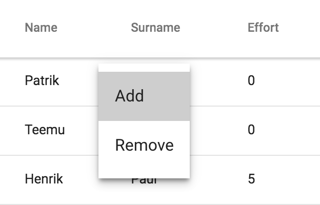

[[vaadin-context-menu.grid]]
= Using with Vaadin Grid

[vaadinelement]#vaadin-grid# has the “detailed events” API, which exposes some properties of the grid internals corresponding to event targets. You can enable detailed events by specifying the desired set of user events in the [propertyname]#detailedEvents# array property of the grid. The detailed events API is supported in [vaadinelement]#vaadin-grid# v1.2.0+.

In the following example, the grid has the [eventname]#vaadin-contextmenu# detailed event enabled, which makes the grid dispatch the [eventname]#detailed-vaadin-contextmenu# custom event, that serves as an opening event for the [vaadinelement]#vaadin-context-menu#.

[source,html]
----
<dom-module id="my-grid-view">
  <template>
    <vaadin-context-menu open-on="detailed-vaadin-contextmenu">
      <template>
        <paper-menu>
          <paper-item on-tap="_add">Add</paper-item>
          <template is="dom-if" if="[[_isGridBody(detail)]]">
            <paper-item detail="[[detail]]" on-tap="_remove">Remove</paper-item>
          </template>
        </paper-menu>
      </template>

      <vaadin-grid id="grid" items="[[items]]">
        <table>
          <colgroup>
            <col name="name">
            <col name="surname">
            <col name="effort">
          </colgroup>
        </table>
      </vaadin-grid>
    </vaadin-context-menu>
  </template>

  
</dom-module>

<my-grid-view></my-grid-view>
----

[[figure.vaadin-context-menu.on-grid]]
.[vaadinelement]#vaadin-context-menu# used on [vaadinelement]#vaadin-grid#

NOTE: The [propertyname]#detail# property from the grid detailed event becomes available in the menu template bindings. In the above example, the [propertyname]#detail# is used to show the “Remove” menu item only in the grid body context menu, and also in to find out the grid row index the [methodname]#_remove# menu item click handler ([propertyname]#e.target.detail.row#).

See also the [vaadinelement]#vaadin-grid# API Reference:

- https://cdn.vaadin.com/vaadin-core-elements/latest/vaadin-grid/#vaadin-grid:property-detailedEvents[[propertyname]#detailedEvents# property]
- https://cdn.vaadin.com/vaadin-core-elements/latest/vaadin-grid/#vaadin-grid:event-detailed-event[[eventname]#detailed-event# event for the list [propertyname]#detail# properties exposed by the grid]
