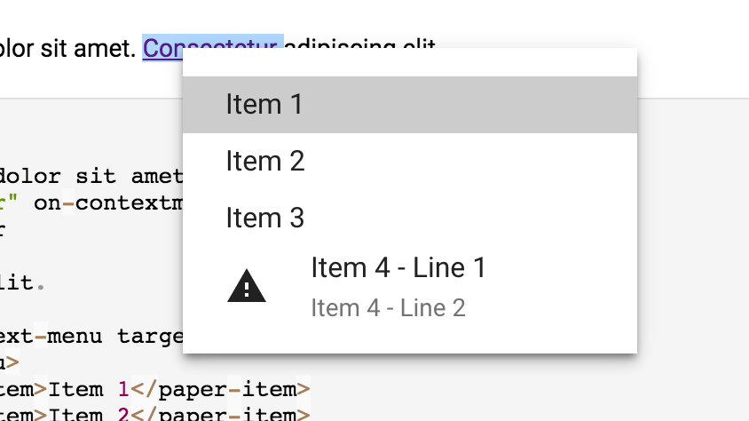

[[vaadin-context-menu.overview]]
= Overview

[vaadinelement]#vaadin-context-menu# is a Polymer element implementing a menu in an overlay which by default is opened by a context click or a long press touch event.

[source,html]
----
<vaadin-context-menu>
  <template>
    <paper-menu>
      <paper-item>First menu item</paper-item>
      <paper-item>Second menu item</paper-item>
    </paper-menu>
  </template>
</vaadin-context-menu>
----

[[figure.vaadin-context-menu.overview]]
.[vaadinelement]#vaadin-context-menu#

== Features

- Uses template to define the menu overlay contents
- Supports data bindings to the context in the menu template
- Opens on both mouse and touch environments
- Automatic fullscreen mode for small viewports
- Configurable opening and closing events, event listener element
- Provides both declarative HTML and imperative JavaScript APIs
