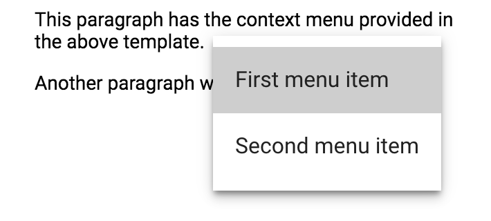

[[vaadin-context-menu.template]]
= The Menu Template

The [vaadinelement]#vaadin-context-menu# element expects a child template with the overlay contents.

You can use any elements in the template to build the actual menu. It is recommended to use [elementname]#paper-menu# and [elementname]#paper-item# for the basic single-level menu use case:

[source,html]
----
<vaadin-context-menu>
  <template>
    <paper-menu>
      <paper-item>First menu item</paper-item>
      <paper-item>Second menu item</paper-item>
    </paper-menu>
  </template>

  
This paragraph has the context menu provided in the above template.

  
Another paragraph with the context menu.

</vaadin-context-menu>
----

[[figure.vaadin-context-menu.on-content]]
.[vaadinelement]#vaadin-context-menu# built with [elementname]#paper-menu# and [elementname]#paper-item# elements

