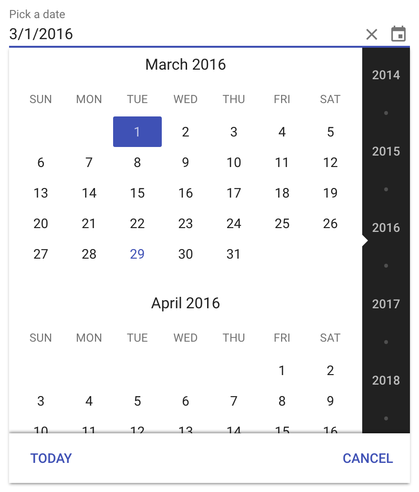

[[vaadin-date-picker.overview]]
= Overview

The [vaadinelement]#vaadin-date-picker# element is a date selection field with a scrollable month calendar view.
The picker opens up as a dropdown when the element gets clicked or tapped.
There's also JavaScript APIs for opening and closing the picker: `datepicker.open()` and `datepicker.close()`.

It has two display modes, full-screen or desktop.
The display mode to use is determined according to the size of the screen.
The user can navigate to a desired month by scrolling the list of years and months and then select a date.
On a desktop browser the input field can also be used for setting the [vaadinelement]#vaadin-date-picker# value directly by typing.

When a date is selected, the user can clear the value with a button on the right side of the selection label.
The dropdown footer has a today button for quickly jumping to the current month.
If the calendar view is already positioned on the current month, then the today button selects today and closes the dropdown.
A cancel button in the footer allows closing the dropdown without affecting the value.

== Keyboard Navigation Overview
When a date is focused using the keyboard, it can be selected or deselected using Space key. +
With Enter key, the focused date is selected and the date picker is closed.
The focused date will also get automatically selected when the overlay is closed +
(except when closing with the cancel button which reverts to the previous value while closing).

Focus can be moved with the following keys: +
Up: a week backward +
Down: a week forward +
Left: a day backward +
Right: a day forward +
Home: focus first day of the month +
End: focus last day of the month +
PageUp: a month backward +
PageDown: a month forward +
Shift+PageUp: a year backward +
Shift+PageDown: a year forward

[[figure.vaadin-date-picker.overview]]
.A screenshot of [vaadinelement]#vaadin-date-picker#

