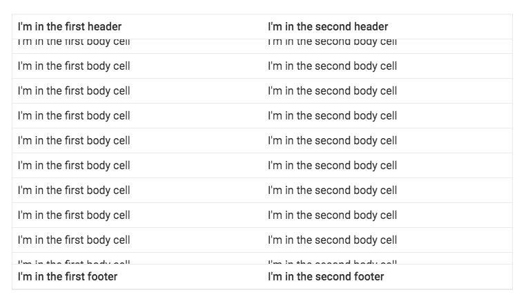

[[vaadin-grid.columns]]
= Configuring Columns

In this section, we will show you how to define and configure columns for your [vaadinelement]#vaadin-grid#.
We will go through the basics of using header, footer and body templates and also take a look into defining groups of columns.

[[vaadin-grid.columns.templates]]
== Column Templates

A [vaadinelement]#vaadin-grid-column# is used to configure how a column in [vaadinelement]#vaadin-grid# should look like by using HTML templates.
A column can have a template for each of the three table sections: header, body and footer.

[propertyname]#class# is used to differentiate header and footer templates
from the body template.

[source,html]
----
<vaadin-grid-column>
  <template class="header">I'm in the header</template>
  <template>I'm in the body</template>
  <template class="footer">I'm in the footer</template>
</vaadin-grid-column>
----

For information how to assign data for the templates, see <<vaadin-grid-assigning-data#vaadin-grid.data, "Assigning Data">>.

[[vaadin-grid.columns.assigning]]
== Assigning Columns

Assigning columns to a [vaadinelement]#vaadin-grid# is done simply by appending them as children.

[source,html]
----
<vaadin-grid>
  <vaadin-grid-column>
    <template class="header">I'm in the first header</template>
    <template>I'm in the first body cell</template>
    <template class="footer">I'm in the first footer</template>
  </vaadin-grid-column>
  <vaadin-grid-column>
    <template class="header">I'm in the second header</template>
    <template>I'm in the second body cell</template>
    <template class="footer">I'm in the second footer</template>
  </vaadin-grid-column>
</vaadin-grid>
----

[[figure.vaadin-grid.columns.basic]]
.Two Columns

[[vaadin-grid.columns.groups]]
== Grouping Columns

In cases when there are many columns, it might help the visual appearance to group related
columns under a common header.

This can be achieved by wrapping the columns inside a [vaadinelement]#vaadin-grid-column-group#.
You can also place nested groups inside the group, if you like.

[source,html]
----
<vaadin-grid>
  <vaadin-grid-column-group>
    <template class="header">I'm in the group header</template>
    <template class="footer">I'm in the group footer</template>
    <vaadin-grid-column>
      <template class="header">I'm in the first header</template>
      <template>I'm in the first body cell</template>
      <template class="footer">I'm in the first footer</template>
    </vaadin-grid-column>
    <vaadin-grid-column>
      <template class="header">I'm in the second header</template>
      <template>I'm in the second body cell</template>
      <template class="footer">I'm in the second footer</template>
    </vaadin-grid-column>
  </vaadin-grid-column-group>
</vaadin-grid>
----

[[vaadin-grid.columns.frozen]]
== Freezing Columns

When a column is frozen, it stays in place when the table is scrolled horizontally.
Freezing is done by applying [propertyname]#frozen# to the column.

[source,html]
----
<vaadin-grid-column frozen>
  <!-- I'm frozen -->
</vaadin-grid-column>
----

[propertyname]#frozen# can also be applied to a [vaadinelement]#vaadin-grid-column-group# which
will freeze all the columns inside that group.

[source,html]
----
<vaadin-grid-column-group frozen>
  <vaadin-grid-column>
    <!-- I'm frozen -->
  </vaadin-grid-column>
  <vaadin-grid-column>
    <!-- I'm frozen -->
  </vaadin-grid-column>
</vaadin-grid-column-group>
----

Additionally, if a column inside a column group is frozen, also the other columns group become frozen.

[source,html]
----
<vaadin-grid-column-group>
  <vaadin-grid-column frozen>
    <!-- I'm frozen -->
  </vaadin-grid-column>
  <vaadin-grid-column>
    <!-- I'm frozen -->
  </vaadin-grid-column>
</vaadin-grid-column-group>
----
