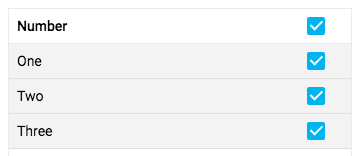

[[vaadin-grid.selection]]
= Selection

Grid allows item based selection of data rows either through UI interaction or using the JavaScript API.
The selection behavior depends on the currently active selection mode.

[[vaadin-grid.selection.mode]]
== Selection Mode

The [vaadinelement]#vaadin-grid# implements multi selection behavior by default. But you need a mechanisim to allow the user to select rows. The easier way is to use the [vaadinelement]#vaadin-grid-selection-column# helper element.

[[vaadin-grid.selection.column]]
== The Selection Column Helper element.

The [vaadinelement]#vaadin-grid-selection-column# provides a selection model that helps the user to select rows using checkboxes displayed in a specific column.
In the case that the grid use an array of items as the data source, it provides the ability of selecting all the items by clicking on the checkbox at the header.

[source,html]
----
<link rel="import" href="../vaadin-grid-selection-column.html">

<vaadin-grid items='["One", "Two", "Tree"]'>
  <vaadin-grid-selection-column>
  </vaadin-grid-selection-column>
  <vaadin-grid-column width="50px">
    <template class="header">Number</template>
  </vaadin-grid-column>
</vaadin-grid>
----

NOTE: that you have to explicitly import the element in your component in order to use [vaadinelement]#vaadin-grid-selection-column#.

[[figure.vaadin-grid.selection.column]]
image::img/vaadin-grid-selection-column.png[]

Eventually, you can customize the selection column by displaying it at any position in the grid, changing it size, or even providing a different template for checkboxes.

[source,html]
----
<link rel="import" href="../vaadin-grid/vaadin-grid-selection-column.html">
<link rel="import" href="../polymer-checkbox/polymer-checkbox.html">

<vaadin-grid items='["One", "Two", "Tree"]'>
  <vaadin-grid-column width="50px">
    <template class="header">Number</template>
  </vaadin-grid-column>

  <vaadin-grid-selection-column width="40px" flex="0" select-all="[[selectAll]]">
    <template class="header">
      <paper-checkbox checked="{{selectAll}}"></paper-checkbox>
    </template>
    <template>
      <paper-checkbox checked="{{selected}}"></paper-checkbox>
    </template>
  </vaadin-grid-selection-column>

</vaadin-grid>
----

[[figure.vaadin-grid.selection.column]]

[[vaadin-grid.selection.api]]
== Selection API

This section explains the basic operations available through the selection API.

[methodname]#grid.selectItem(item)#::
  Selects the row with the given item. If the selection mode is `single`, the method deselects the previously selected row.

[methodname]#grid.deselectItem(item)#::
  Deselects the row with the given item.

[[vaadin-grid.selection.selected]]
== Accessing the Selected Rows

The [vaadinelement]#vaadin-grid# defines a property [propertyname]#selectedItems# that represents the list of selected items. It also notifies changes to it by firing a 'selected-items-changed' -event.

[source,javascript]
----
// Log the selections to console on select event.
// Example output: "Selected: 3,5,6"
grid.addEventListener('selected-items-changed', function() {
  console.log('Selected: ' + grid.selectedItems);
});
----
