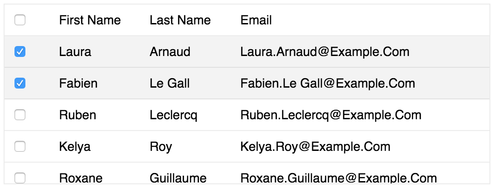
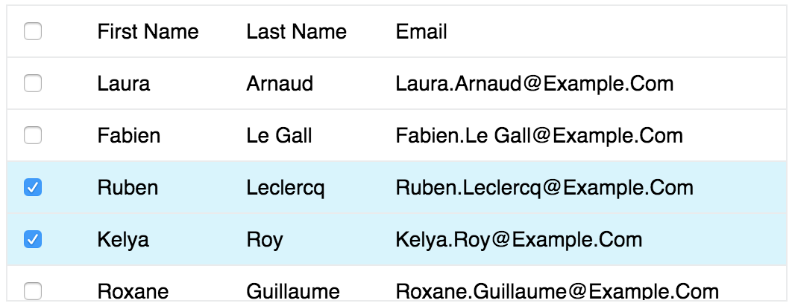
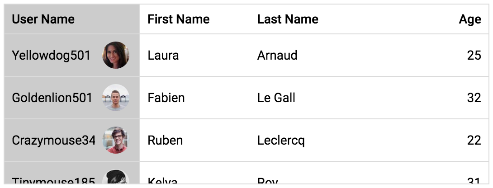

[[vaadin-grid.styling]]
= Styling

The default appearance of [vaadinelement]#vaadin-grid# is quite neutral.
It inherits CSS properties such as [propertyname]#font-size# from the containing document, data rows are divided with gray borders, and selected rows get highlighted.

[[figure.vaadin-grid.styling.default]]

This section explains how to customize the [vaadinelement]#vaadin-grid#'s appearance to make it fit your application theme by using the built-in style mixins, and how to leverage the column templates for further modifications.

See the link:https://cdn.vaadin.com/vaadin-core-elements/preview/vaadin-grid/demo/styling.html[live demos] for more thorough examples on how the grid can be modified to comply link:https://material.io/guidelines/components/data-tables.html[Material Design] specification, how to define data rows with rounded borders and more.

[[vaadin-grid.styling.mixins]]
== Styling With Style Mixins

The vaadin-grid bundles a set of pre-defined style mixins intended for easy styling of the grid's cells in various different states and contexts.

For example you might want a specific background color just for the header cells, or to separate the frozen columns from others by a drop shadow.
The style mixins of [vaadinelement]#vaadin-grid# are the right tool for that.

[NOTE]
====
If you're not familiar with how style mixins work, take a look to the Polymer link:https://www.polymer-project.org/1.0/docs/devguide/styling#custom-css-mixins[guide on custom CSS mixins].
====

A comprehensive list of [vaadinelement]#vaadin-grid# style mixins is available at the link:https://cdn.vaadin.com/vaadin-core-elements/preview/vaadin-grid/[API documentation].

The following example demonstrates how you could achieve a striped, borderless [vaadinelement]#vaadin-grid# with the header section colored differently.

[source,html]
----

----

[[figure.vaadin-grid.styling.striped]]
image::img/vaadin-grid-styling-striped.png[width="450"]

By default, [vaadinelement]#vaadin-grid# divides its data rows with horizontal borders.
Borders are also used for separating the header and footer sections from the body and the frozen columns from non-frozen ones.
Their color defaults to [propertyname]#--divider-color# CSS property if available, otherwise, a fallback color is used.

Another default style in [vaadinelement]#vaadin-grid# is the background color of selected rows.
It derives from [propertyname]#--paper-grey-100# and when not available, a fallback color is used.

Changing the [vaadinelement]#vaadin-grid#'s border color and the background color of selected row cells can be achieved as follows.

[source,html]
----

----

[[figure.vaadin-grid.styling.default-modified]]

The [vaadinelement]#vaadin-grid-sorter# also exposes a set of it's own link:https://cdn.vaadin.com/vaadin-core-elements/preview/vaadin-grid/#vaadin-grid-sorter[style mixins].
The following example shows how to customize [vaadinelement]#vaadin-grid-sorter#.

[source,html]
----

----

[[figure.vaadin-grid.styling.sorter]]
image::img/vaadin-grid-styling-sorter.png[width="450"]

[[vaadin-grid.styling.templates]]
== Custom Styling With Column Templates

In addition to the style mixins, column templates provide a handy means for making specific style adjustments to [vaadinelement]#vaadin-grid# cells.
Since the cell content doesn't get hidden inside the [vaadinelement]#vaadin-grid#'s shadow root, it can be targeted with standard CSS selectors.

For example, you might want to align columns with numeric data to the right and have the frozen columns styled with a different background.

[source,html]
----

...

<vaadin-grid-column width="100px" frozen>
  <template class="header">
    
User Name

  </template>
  <template>
    
[[item.username]]

  </template>
</vaadin-grid-column>

...

<vaadin-grid-column>
  <template class="header">
    
Age

  </template>
  <template>
    
[[item.age]]

  </template>
</vaadin-grid-column>
----

[[figure.vaadin-grid.styling.templates]]

