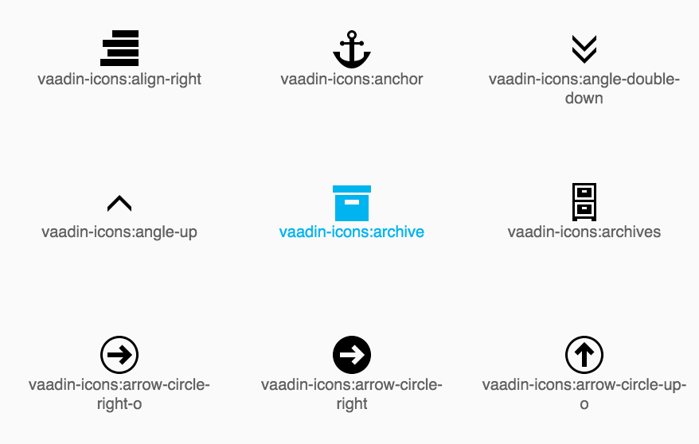

[](https://gitter.im/vaadin/vaadin-core-elements?utm_source=badge&utm_medium=badge&utm_campaign=pr-badge)


# vaadin-icons

[`vaadin-icons`](https://vaadin.com/elements/-/element/vaadin-icons) is a set of 500+ icons which can be used together with Polymer's `<iron-icon>` component.
`vaadin-icons` is a part of the [vaadin-core-elements](https://vaadin/elements) element bundle.



## Features
- Compatible with [`<iron-icon>`](https://elements.polymer-project.org/elements/iron-icon) and [`<iron-iconset>`](https://elements.polymer-project.org/elements/iron-iconset)
- Compatible with any component using `<iron-icon>` and exposing `icon` property, e.g. [`<paper-fab>`](https://elements.polymer-project.org/elements/paper-fab)
- [Evolving set of over 500 icons](https://vaadin.com/font-icons)
- In addition to SVG, also PNG and font formats are available separately.

See more information at https://vaadin.com/elements/-/element/vaadin-icons.

## Getting started
- [Demos](https://vaadin.com/elements/-/element/vaadin-icons)
- [API Documentation](https://cdn.vaadin.com/vaadin-core-elements/master/vaadin-icons/)

## Developing
Install required dependencies by running following lines in the project root.

```sh
$ npm install -g polyserve
$ npm install
$ bower install
```

### Running the demos
Start a local server in the project root.
```sh
$ polyserve
```

After `polyserve` is running, open http://localhost:8080/components/vaadin-icons/demo/ in your browser.

## License
`vaadin-icons` is licensed under the Apache License 2.0.
