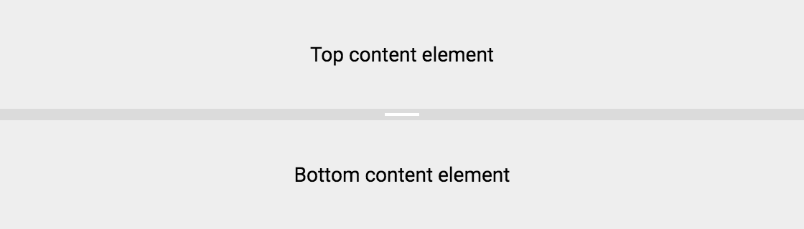
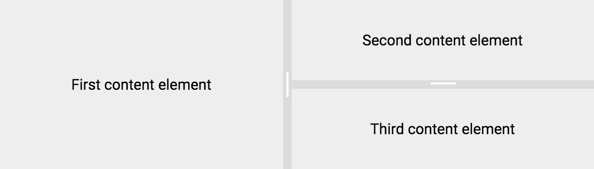

[[vaadin-split-layout.layouts]]
= Horizontal and Vertical Layouts

== Horizontal Layout

The [vaadinelement]#vaadin-split-layout# element can arrange the content elements in either a horizontal (side by side) or a vertical layout. By default, the horizontal layout is used.

== Vertical Layout

You can change the layout to vertical by using the `vertical` attribute:

[source,html]
----
<vaadin-split-layout vertical>
  
Top content element

  
Bottom content element

</vaadin-split-layout>
----

[[figure.vaadin-split-layout.layouts.vertical]]
.A screenshot of [vaadinelement]#vaadin-split-layout# with a vertical layout

You can also trigger the vertical mode by setting the property:

[source,javascript]
----
splitLayout.vertical = true;
----

== Layouts Combination

For the layout contents, we usually use [elementname]#div# elements in the examples, but you can use any other elements as well.

For instance, in order to have a nested vertical split layout inside a horizontal one, you can include [vaadinelement]#vaadin-split-layout# as a content element inside another split layout:

[source,html]
----
<vaadin-split-layout>
  
First content element

  <vaadin-split-layout vertical>
    
Second content element

    
Third content element

  </vaadin-split-layout>
</vaadin-split-layout>
----

[[figure.vaadin-split-layout.layouts.vertical]]
.A screenshot of nested [vaadinelement]#vaadin-split-layout# elements with different layouts

