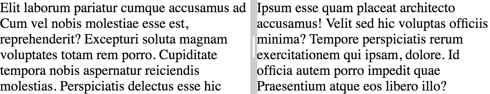

[[vaadin-split-layout.overview]]
= Overview

The [vaadinelement]#vaadin-split-layout# is a Polymer element implementing a split layout for two content elements with a draggable splitter between them.

[source,html]
----
<vaadin-split-layout>
  
Elit laborum pariatur cumque accusamus ad Cum vel nobis molestiae esse est, reprehenderit? Excepturi soluta magnam voluptates totam rem porro. Cupiditate tempora nobis aspernatur reiciendis molestias. Perspiciatis delectus esse hic

  
Ipsum esse quam placeat architecto accusamus! Velit sed hic voluptas officiis minima? Tempore perspiciatis rerum exercitationem qui ipsam, dolore. Id officia autem porro impedit quae Praesentium atque eos libero illo?

</vaadin-split-layout>
----

[[figure.vaadin-split-layout.overview]]
.[vaadinelement]#vaadin-split-layout#

== Features

- Touch resizing support with a large touch target area around the splitter handle in the middle of the splitter between the contents
- Provides horizontal and vertical split layouts with two content elements
- Supports any content elements, not only `div`
- Supports nesting and complex layout combinations
- Respects the sizes (`width` and `height` style properties) and the size limits (`min-width`, `max-width`) specified for the content elements
- When resized, notifies the nested elements with `IronResizableBehavior`
- Customizable styles for the splitter, replaceable splitter handle
