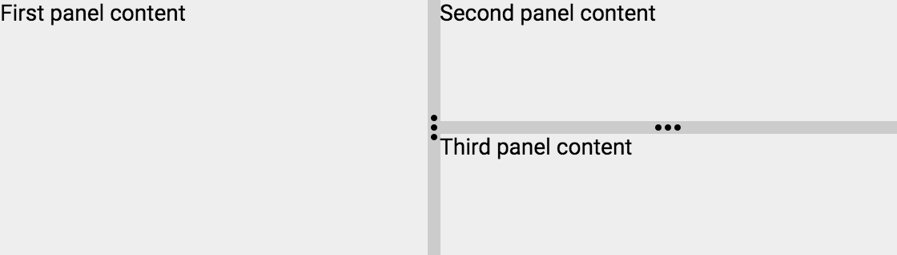

[[vaadin-split-panel.layouts]]
= Horizontal and Vertical Layouts

== Horizontal Layout

The [vaadinelement]#vaadin-split-panel# element can arrange the content elements in either a horizontal (side by side) or a vertical layout. By default, the horizontal layout is used.

== Vertical Layout

You can change the layout to vertical by using the `vertical` attribute:

[source,html]
----
<vaadin-split-panel vertical>
  
Top panel content

  
Bottom panel content

</vaadin-split-panel>
----

[[figure.vaadin-split-panel.layouts.vertical]]
.A screenshot of [vaadinelement]#vaadin-split-panel# with a vertical layout
image::img/vaadin-split-panel-vertical.png[width="560"]

== Layouts Combination

You can combine different layouts by using nested [vaadinelement]#vaadin-split-panel# elements:

[source,html]
----
<vaadin-split-panel>
  
First panel content

  <vaadin-split-panel vertical>
    
Second panel content

    
Third panel content

  </vaadin-split-panel>
</vaadin-split-panel>
----

[[figure.vaadin-split-panel.layouts.vertical]]
.A screenshot of nested [vaadinelement]#vaadin-split-panel# elements with different layouts

