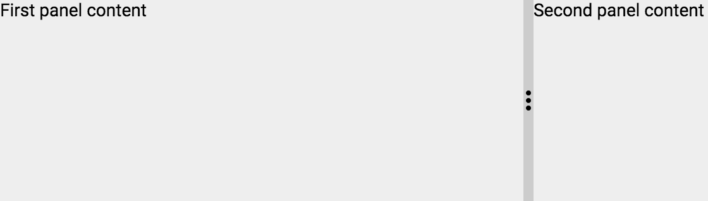

[[vaadin-split-panel.sizes]]
= Customizing the Sizes

== Specifying the Initial Size

The sizes for the content elements in the [vaadinelement]#vaadin-split-panel# element are determined from the corresponding size values and scaled proportionally to fit into the split panel element. The `width` values are used for the horizontal layout, and the `height` values are used for the vertical one.

You can customize the initial sizes by resizing the content elements. For example, using inline styles:

[source,html]
----
<vaadin-split-panel>
  
First panel content

  
Second panel content

</vaadin-split-panel>
----

[[figure.vaadin-split-panel.sizes.initial]]
.A screenshot of [vaadinelement]#vaadin-split-panel# with custom initial sizes

== Specifying the Size Limits

By default, the user can resize the split until one of the content elements is collapsed.

You can set the limit for the resizing and prevent collapsing of the content elements by specifying a `min-` or a `max-` style property corresponding to the layout: `min-width` and `max-width` have effect for the horizontal layout, `min-height` and `max-height` for the vertical layout.

It is usually enough to set the limits on just one content element, either a first one or a second one.

[source,html]
----
<vaadin-split-panel>
  
First

  
Second

</vaadin-split-panel>
----
