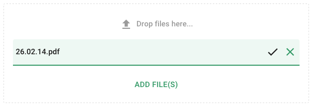
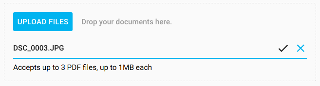

[[vaadin-upload.custom]]
= Customization

It is possible to customize the [elementname]#vaadin-upload# element in two ways: by changing default styles or by providing custom content.

== Styling

To override default styles you should use Polymer mixins.

[source,html]
----

 <vaadin-upload></vaadin-upload>
----

[[figure.vaadin-upload.custom1]]
.A Custom CSS

=== Color properties
[elementname]#vaadin-upload# reuses certain color properties from link:https://elements.polymer-project.org/elements/paper-styles[paper-styles]:

[width="100%", options="header"]
|======================
|Property name | default color
| [propertyname]#--primary-color# | #00B4F0
| [propertyname]#--primary-text-color# | #000
| [propertyname]#--light-primary-color# | #7CD8F7
| [propertyname]#--error-color# | #f40303
| [propertyname]#--disabled-text-color# | #b3b3b3 or gray
| [propertyname]#--divider-color# |  #666 or #e0e0e0
|======================

=== Custom CSS Properties

The following custom properties are available for styling the component.

==== Styles for the [elementname]#vaadin-upload# element

[width="100%", options="header"]
|======================
|Property name | Description
| [propertyname]#--vaadin-upload-buttons# | A mixin that is applied to the buttons container
| [propertyname]#--vaadin-upload-buttons-primary# | A mixin that is applied to the primary buttons container (on the left side)
| [propertyname]#--vaadin-upload-buttons-secondary# | A mixin that is applied to the secondary buttons container (on the right side)
| [propertyname]#--vaadin-upload-button-add# | A mixin that is applied to the upload button
| [propertyname]#--vaadin-upload-button-add-disabled# | A mixin that is applied to the upload button when [propertyname]#maxFiles# limit is reached
| [propertyname]#--vaadin-upload-file-list# | A mixin that is applied to the file list
| [propertyname]#--vaadin-upload-drop-label# | A mixin that is applied to the drop label
| [propertyname]#--vaadin-upload-drop-label-dragover# | A mixin that is applied to the drop label when overing the component with files
| [propertyname]#--vaadin-upload-drop-label-icon# | A mixin that is applied to the drop icon
| [propertyname]#--vaadin-upload-drag-ripple# | A mixin that is applied to the ripple animation in the drop area
|======================

==== Styles for the [elementname]#vaadin-upload-file# Element

[width="100%", options="header"]
|======================
|Property name | Description
| [propertyname]#--vaadin-upload-file# | A mixin that is applied to the host element
| [propertyname]#--vaadin-upload-file-row# | A mixin that is applied to the file row
| [propertyname]#--vaadin-upload-file-status-icon# | A mixin that is applied to all file status icons. By default, file status icons are hidden until the upload process finishes.
| [propertyname]#--vaadin-upload-file-status-icon-complete# | A mixin that is applied to the complete status icon when the upload process succeeds
| [propertyname]#--vaadin-upload-file-status-icon-error# | A mixin that is applied to the error status icon when the upload process fails
| [propertyname]#--vaadin-upload-file-meta# | A mixin that is applied to the info container
| [propertyname]#--vaadin-upload-file-meta-complete# | A mixin that is applied to the info container when file upload is complete
| [propertyname]#--vaadin-upload-file-meta-error# | A mixin that is applied to the info container when an error happens
| [propertyname]#--vaadin-upload-file-name# | A mixin that is applied to the file name
| [propertyname]#--vaadin-upload-file-status# | A mixin that is applied to the file status label
| [propertyname]#--vaadin-upload-file-error# | A mixin that is applied to the file error label
| [propertyname]#--vaadin-upload-file-commands# | A mixin that is applied to the buttons container
| [propertyname]#--vaadin-upload-file-progress# | A mixin that is applied to the included paper-progress
| [propertyname]#--vaadin-upload-file-progress-error# | A mixin that is applied to the progress bar when error is set
| [propertyname]#--vaadin-upload-file-progress-indeterminate# | A mixin that is applied to the progress bar when indeterminate
| [propertyname]#--vaadin-upload-file-progress-uploading-indeterminate# | A mixin that is applied to the progress bar when uploading and indeterminate
| [propertyname]#--vaadin-upload-file-progress-complete# | A mixin that is applied to the progress when the file is complete
| [propertyname]#--vaadin-upload-file-canceled# | A mixin that is applied to the upload cancel animation
|======================

== Modifying the Content

The [elementname]#vaadin-upload# element provides content composition through the element's light DOM.

There are three modifiable parts: the drop label content, the file list, and the section after it.
The first part must be marked with the class name `drop-label`, the file list with `file-list`, and the third one is composed of the remaining element content.

The following example shows how to modify them:

[source,html]
----
<vaadin-upload >
  

    Drop your documents here.
  

  

    <ul>
      <template is="dom-repeat" items="{{files}}" as="file">
        <li>[[file.name]]: [[file.status]]
      </template>
    </ul>
  

  

    Accepts up to 3 PDF files, up to 1MB each
  

</vaadin-upload>
----

[[figure.vaadin-upload.custom2]]
.Custom content

