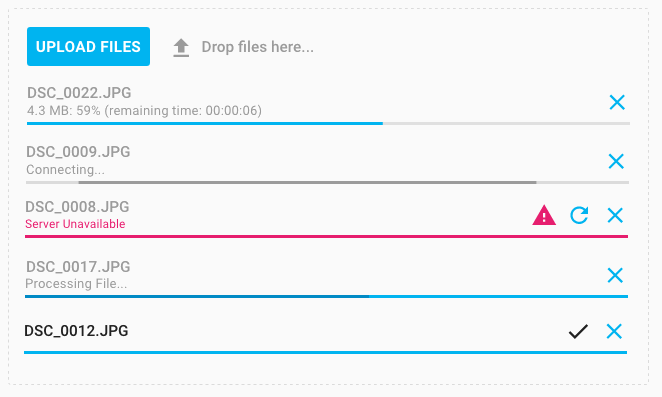

[[vaadin-upload.overview]]
= Overview

The [elementname]#vaadin-upload# is a UI component for uploading multiple files to the server.

It has two ways to select files to upload, dropping files into the component, or using the native browser file selector by clicking on the [guibutton]#Add Files# button.

When the user selects one or more files, they are displayed in a file list inside the element, and the uploads start automatically. Uploading of multiple files is performed simultaneously.

In the list, the state and uploading progress is shown for each file.

The user can cancel the upload of a file and remove it from the list by pressing the cancel button for the particular file.
If the button is pressed while the file upload is in progress, the upload process will be aborted.

If something was wrong with the upload of a file, an error message and a retry button are displayed.
By clicking on this button the user can restart the upload process.

[[figure.vaadin-upload.overview]]
.A screenshot of the [vaadinelement]#vaadin-upload# element

